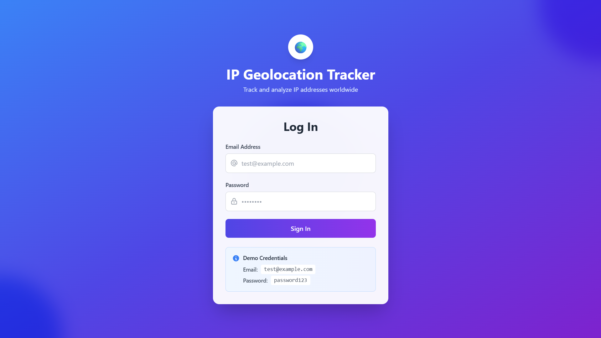
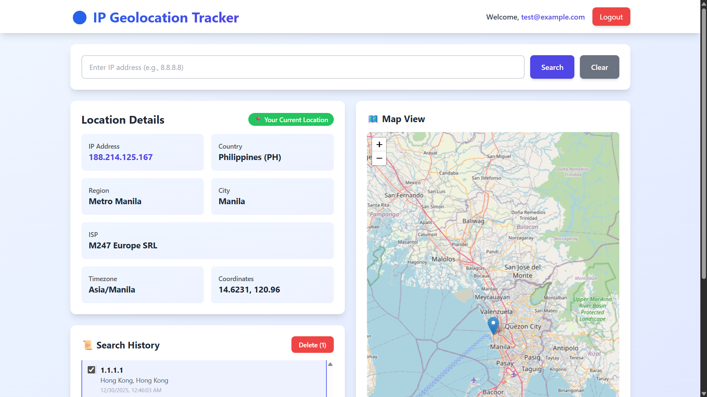
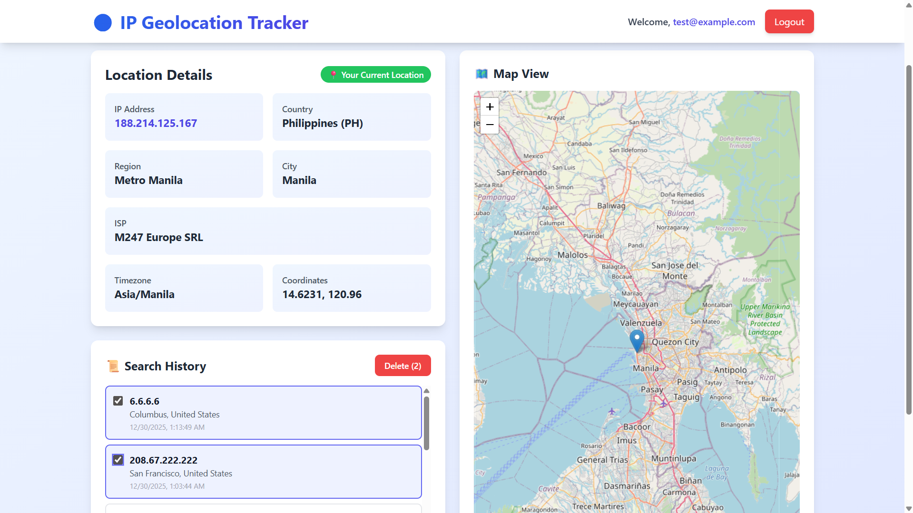

# 🌍 IP Geolocation Tracker

A full-stack web application that allows users to track and visualize IP address geolocation information with interactive maps and search history.

## 📋 Features

- ✅ User authentication with JWT tokens
- ✅ Login form with email/password validation
- ✅ Auto-detect user's current IP geolocation
- ✅ Search any IP address and display geolocation details
- ✅ Interactive map with pinned locations (using Leaflet)
- ✅ Search history with clickable entries
- ✅ Bulk delete history items with checkboxes
- ✅ IP address validation
- ✅ Clear search to return to user's location
- ✅ Responsive design for mobile and desktop

## 🛠️ Tech Stack

### Backend
- **Node.js** with Express.js
- **MySQL** database
- **JWT** for authentication
- **bcryptjs** for password hashing
- **IP-API.com** for geolocation data

### Frontend
- **React** with Vite
- **React Router** for navigation
- **Axios** for API calls
- **Leaflet & React-Leaflet** for interactive maps
- **Tailwind CSS** for styling

## 📦 Installation & Setup

### Prerequisites
- Node.js (v16 or higher)
- MySQL (v8 or higher)
- npm or yarn

### Backend Setup

1. **Clone the repository**
   ```bash
   git clone <your-repo-url>
   cd <repo-name>
   ```

2. **Install backend dependencies**
   ```bash
   cd backend
   npm install
   ```

3. **Configure environment variables**
   
   Create a `.env` file in the `backend` directory:
   ```env
   DB_HOST=localhost
   DB_USER=root
   DB_PASSWORD=
   DB_NAME=ip_geo_app
   JWT_SECRET=your_jwt_secret_key_here
   PORT=8000
   ```

4. **Create the database**
   
   Run the following SQL commands in your MySQL client:
   ```sql
   CREATE DATABASE IF NOT EXISTS ip_geo_app;
   USE ip_geo_app;

   CREATE TABLE users (
     id INT PRIMARY KEY AUTO_INCREMENT,
     email VARCHAR(100) UNIQUE NOT NULL,
     password VARCHAR(255) NOT NULL,
     created_at TIMESTAMP DEFAULT CURRENT_TIMESTAMP
   );

   CREATE TABLE search_history (
     id INT PRIMARY KEY AUTO_INCREMENT,
     user_id INT,
     ip_address VARCHAR(45),
     country VARCHAR(100),
     city VARCHAR(100),
     isp VARCHAR(255),
     searched_at TIMESTAMP DEFAULT CURRENT_TIMESTAMP,
     FOREIGN KEY (user_id) REFERENCES users(id) ON DELETE CASCADE
   );
   ```

5. **Seed the database with test user**
   ```bash
   npm run seed
   ```
   
   This creates a test user:
   - Email: `test@example.com`
   - Password: `password123`

6. **Start the backend server**
   ```bash
   npm start
   ```
   
   Server will run on `http://localhost:8000`

### Frontend Setup

1. **Install frontend dependencies**
   ```bash
   cd ../frontend
   npm install
   ```

2. **Configure environment variables**
   
   Create a `.env` file in the `frontend` directory:
   ```env
   VITE_API_URL=http://localhost:8000
   ```

3. **Start the development server**
   ```bash
   npm run dev
   ```
   
   Frontend will run on `http://localhost:5173`

## 🚀 Usage

1. Open your browser and navigate to `http://localhost:5173`
2. Log in using the demo credentials:
   - **Email**: `test@example.com`
   - **Password**: `password123`
3. The app will automatically detect and display your current IP geolocation
4. Enter any valid IP address in the search box to view its location
5. Click on history items to revisit previous searches
6. Select multiple history items and delete them using the checkbox feature

## 📁 Project Structure

```
├── backend/               # Backend (Node.js + Express)
│   ├── server.js          # Main server file with all routes
│   ├── seed.js            # Database seeder
│   ├── package.json       # Backend dependencies
│   └── .env               # Environment variables
│
├── frontend/                    # Frontend (React)
│   ├── src/
│   │   ├── components/
│   │   │   ├── Login.jsx  # Login page component
│   │   │   └── Home.jsx   # Home page with map & search
│   │   ├── App.jsx        # Main app component
│   │   └── main.jsx       # Entry point
│   ├── package.json       # Frontend dependencies
│   └── .env               # Environment variables
│
└── README.md              # This file
```

## 🔑 API Endpoints

### Authentication
- `POST /api/login` - Login with email and password

### Geolocation
- `GET /api/geo` - Get current user's IP geolocation
- `GET /api/geo/:ip` - Get geolocation for specific IP address

### History
- `GET /api/history` - Get user's search history
- `DELETE /api/history` - Delete multiple history items

## 🌟 Demo Credentials

- **Email**: `test@example.com`
- **Password**: `password123`

## 📸 Screenshots

### Login Page
   

   ### Home Screen with Map
   

   ### Search History
   

## 🐛 Known Issues

- When running locally, the app may detect `127.0.0.1` or `::1` as the IP address
- IP-API.com has rate limits for free tier (45 requests/minute)

## 📝 Notes

- Make sure MySQL is running before starting the backend server
- The JWT token expires after 24 hours
- All API requests (except login) require authentication

## 📄 License

This project is open source and available for educational purposes.